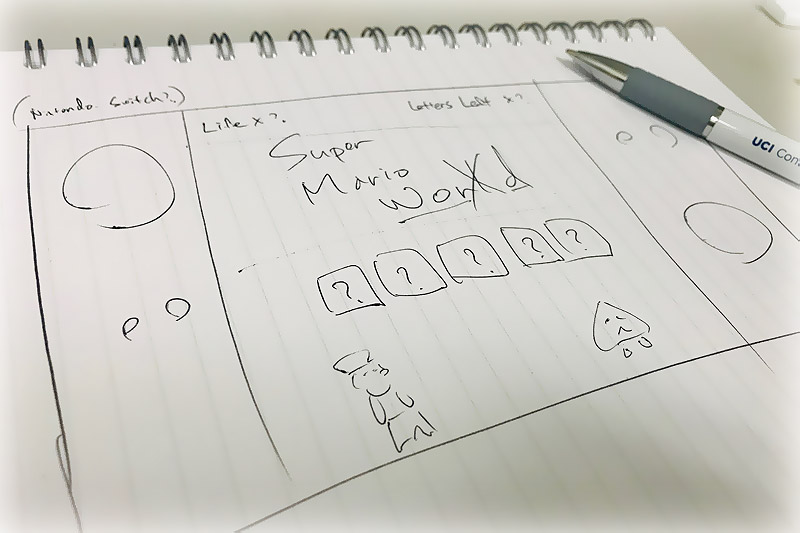

# Super Mario Word

### Overview

This is a Mario-themed word guessing game 'Hangman'.  
Created with HTML, CSS, and JavaScript.  [Click here to try this game.](https://aka-joe.github.io/Word-Guess-Game/)

### Concept Design



### How to play

1. Select difficulty.
Pless '1' or '2' to select 'Easy Mode' or 'Hard Mode'.

2. Guess the word and press any letter key.  
(Hint: all words are related to Mario game.)

3. If that letter is in the word then it will show in the brick.  
If the letter isn't in the word, your life count goes down by 1.

4. Repeat until you solve the word or your life count is 0.

5. If you want to try again, press 'Enter' at the end of the game.

### Key Codes

```
document.onkeyup = function (e) {
    var userInput = e.key;
    userInput = userInput.toLowerCase();
    var codeInput = userInput.charCodeAt(0);
    // Check the game status, if it is not playing, exit the function
    if (remainingLetters === 0 || remainingChances === 0) {
        return;
    }
    // Valid only 'a~z' keys only
    if (userInput.length === 1 && codeInput >= 97 && codeInput <= 122) {
        // Check the input key whether have been used or not
        if (alphabets[codeInput - 97]) {
            alphabets[codeInput - 97] = false;
            // Check with user input and the answer
            guessRight = false;
            for (i = 0; i < word.length; i++) {
                if (word[i] === userInput) {
                    guessRight = true;
                    answerArray[i] = userInput;
                    remainingLetters--;
}}}}};
```
